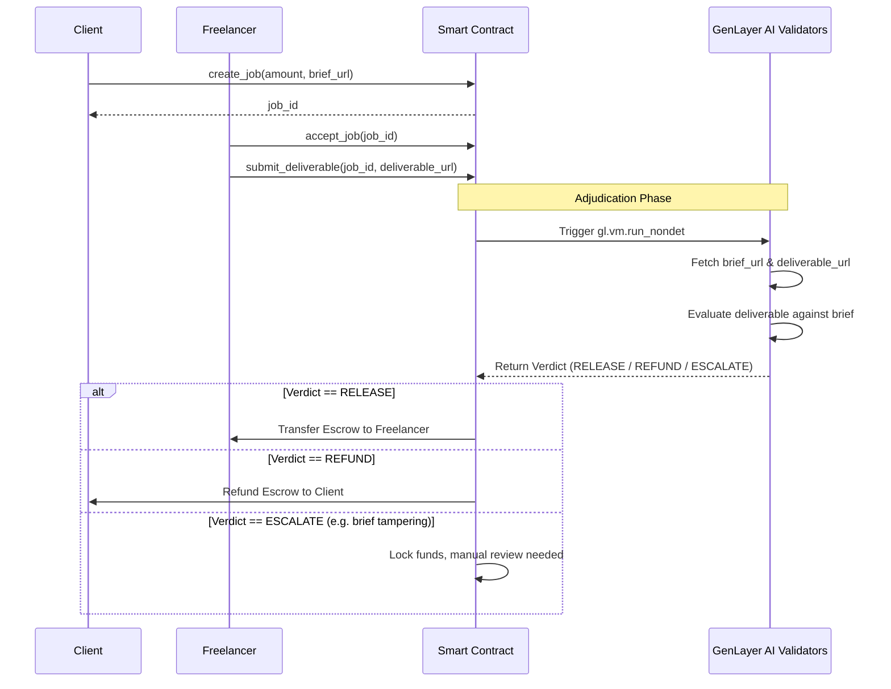

# DeliverableCourt Architecture

DeliverableCourt is built on GenLayer's Intelligent Smart Contract platform, providing an AI-driven escrow service for subjective deliverables.

## Core Components

1. **Intelligent Smart Contract (`contracts/deliverable_court.py`)**
   - Written in Python for GenVM.
   - Manages state (Jobs, Balances).
   - Uses `gl.vm.run_nondet` for subjective AI adjudication.

2. **Frontend dApp (`frontend/src/App.tsx`)**
   - React + Vite + TailwindCSS.
   - Uses `genlayer-js` to communicate with the GenLayer StudioNet.
   - Connects to user wallets for signing transactions.

## Flow Diagram

## Storage Design
- `jobs: TreeMap[str, Job]`
- `Job` struct uses `bigint` for financial values to prevent overflow constraints and ensures type safety per GenLayer standards.
